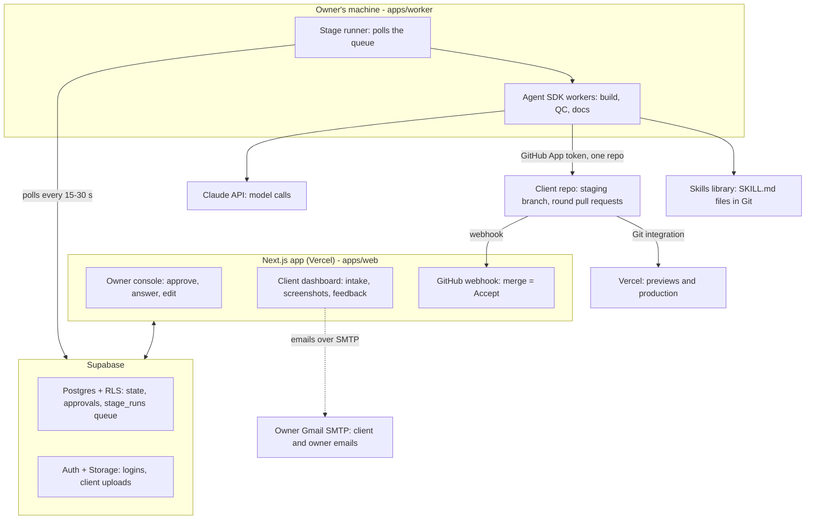

# Architecture and stack

> Originally a snapshot of the Claude Doc "CreatePipeline Engine: Locked Spec" (2026-10-05). The repo is the source of truth; this file includes the owner-approved decisions D-038 to D-069 recorded in `DECISIONS.md`. Agents must not edit files in `docs/spec/`; propose changes in `docs/proposals/` (see `AGENTS.md`).

The pipeline is one Next.js app on Vercel, a Supabase backend, and a stage runner on the owner's machine that starts Agent SDK workers.

Approvals are stored in Supabase; an approval enqueues the next run, and the stage runner starts a worker only for a queued, approved stage. Workers reach only the tools shown: the skills library, one client repo through a short-lived GitHub App token, and the Claude API. Vercel deploys from the repo through its Git integration, so workers hold no Vercel token. Screenshots and QC measurements come from a local production build the worker serves itself; Vercel previews stay behind Vercel's login and only the owner views them.

**Stack:** Next.js, TypeScript, Tailwind CSS, Supabase (Postgres, Auth, Storage), GitHub App, Vercel, Gmail SMTP for the pipeline's own email, Claude Agent SDK (TypeScript), Lighthouse CLI, Playwright.

**Stage runner interface:** each stage is a function `run(stage, project)` that returns a result and the next gate. The runner polls the `stage_runs` queue every 15 to 30 seconds and claims work atomically (`FOR UPDATE SKIP LOCKED`), refreshing a heartbeat while it works; a stale heartbeat re-queues the run. A runner that was offline simply finds the queue waiting. Realtime may be added later purely as a speed-up. Moving to Inngest or Trigger.dev later means replacing only the runner, not the stages.

**Repo mapping:** `apps/web` is the Next.js app; `apps/worker` is the stage runner and Agent SDK workers; `packages/shared` holds stage and gate types and generated database types. The web app must never hold worker secrets.

**Project setup:** an owner-run provisioning script creates each client repo from `templates/master-starter`, installs the GitHub App on it, creates and links the Vercel project, and records the IDs in `projects`. See 15-operations.md.
