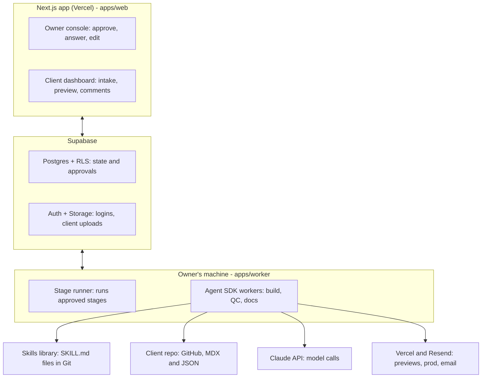

# Architecture and stack

> Snapshot of the Claude Doc "CreatePipeline Engine: Locked Spec" (as of 2026-10-05). From this commit the repo is the source of truth. Agents must not edit files in `docs/spec/`; propose changes in `docs/proposals/` (see `AGENTS.md`).

The pipeline is one Next.js app on Vercel, a Supabase backend, and a stage runner on the owner's machine that starts Agent SDK workers.

Approvals are stored in Supabase; the stage runner starts a worker only for an approved stage, and workers reach only the tools in the bottom row.

**Stack:** Next.js, TypeScript, Tailwind CSS, Supabase (Postgres, Auth, Storage, Realtime), Vercel, Resend, Claude Agent SDK (TypeScript), Lighthouse CLI, Playwright.

**Stage runner interface:** each stage is a function `run(stage, project)` that returns a result and the next gate. Supabase Realtime wakes the local runner when the owner approves. Moving to Inngest or Trigger.dev later means replacing only the runner, not the stages.

**Repo mapping:** `apps/web` is the Next.js app; `apps/worker` is the stage runner and Agent SDK workers; `packages/shared` holds stage and gate types and generated database types. The web app must never hold worker secrets.
