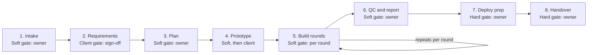

# Pipeline phases and gates

> Originally a snapshot of the Claude Doc "CreatePipeline Engine: Locked Spec" (2026-10-05). The repo is the source of truth; this file reflects the owner-approved decisions recorded in `DECISIONS.md`. Agents must not edit files in `docs/spec/`; propose changes in `docs/proposals/` (see `AGENTS.md`).

The pipeline has eight stages, and each one ends with a stored approval before the next begins. Machine-readable definitions: [stages.yaml](stages.yaml) and [gates.yaml](gates.yaml).

The client approves at the PRD and the prototype; every other gate is the owner's. Feedback sends an artifact back to its agent as a new version with the owner's notes, Reject sends the stage back without a new version, and the stage stays open until the owner accepts.

**Stage outputs:** intake record, PRD v1.0, plan with skill set, design brief, token budget and round scope, prototype screenshots, one pull request, preview and backlog per round, QC results and report, final screenshots, deployment checklist, handover pack.

### Gate types

Every stage ends in one of three gate types. None advances automatically: the owner always acts, and a gate that waits longer than its `escalate_after_hours` (24 for every gate to start with) only shows an overdue badge in the approval queue.

| Gate type | Used for | Who acts | Notes |
| --- | --- | --- | --- |
| Soft | Reversible actions: intake, plan, prototype (owner review), build rounds, QC and report | Owner | Feedback sends notes back and the agent produces a new version; QC failures become a fix list |
| Hard | Irreversible actions: deploy prep, handover | Owner | Same Accept action as the other gates; the type is a label in the queue and tables |
| Client | Client-attributed approvals: PRD lock, prototype sign-off | Client | Recorded as a client approval |

**Gate actions:** Accept approves and advances. Feedback sends notes back and the agent produces a new version. Reject sends the stage back without a new version. In build rounds, a merge of the round's pull request into `staging` by the owner's own GitHub account also counts as Accept (see 07-build-rounds.md).

**Gate classification:**

| Stage | Gate type | Gatekeeper | Escalate after |
| --- | --- | --- | --- |
| 1. Intake | Soft | Owner | 24 hours |
| 2. Requirements (PRD lock) | Client | Client; owner edits are part of the stage | 24 hours |
| 3. Plan | Soft | Owner | 24 hours |
| 4. Prototype | Soft, then Client (two approval records) | Owner, then client | 24 hours each |
| 5. Build rounds | Soft | Owner, each round | 24 hours |
| 6. QC and report | Soft | Owner; QC results and report approved together in one gate | 24 hours |
| 7. Deploy prep | Hard | Owner | 24 hours |
| 8. Handover | Hard | Owner | 24 hours |

Per-stage values live in `gate_config`: global defaults, with per-project overrides.

**Loops and limits:**

- Prototype: at most 2 revision cycles. A cycle starts each time the owner sends feedback to the agent for a new prototype version; the first version does not count. Further changes need the owner's decision, for example a change request.
- Rounds: at most 3 Feedback loops per round, then the owner must Accept or Reject. After each approved round the Planner re-plans the remaining rounds and the owner approves the updated plan before the next round starts.
- QC: at most 2 fix loops; after that the report lists the remaining issues for the owner to accept or fix manually.
- Paused: the owner can pause a project at any time; agents stop and data is kept. A cancelled project is closed and archived like a finished one.
- Cost: token use is shown as a progress bar against the project's token budget (tokens only, no dollar amounts, no warnings); nothing pauses automatically.
**Closing and releases (D-220, D-223):** marking the handover complete moves the project to stage `closed`, sets status `closed` and reason `completed` in one `advance_stage()` call. After go-live and before close, each accepted change request is built as a mini-round and ends in a hard-gate deploy approval by the owner, attached to a release-note artifact. That approval is not a stage gate, so it can never advance or close the project; `advance_stage()` counts only approvals on the stage's own output artifacts.
